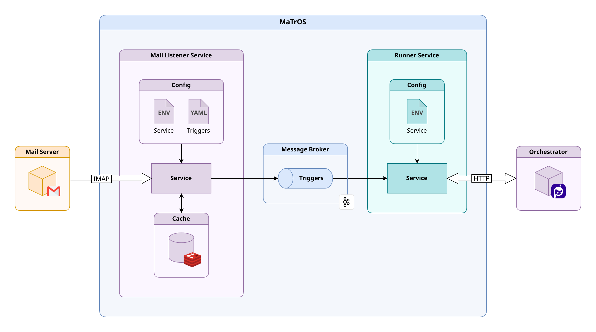

## Under development!

**MaTrOS** is **Ma**il **Tr**iggered **O**rchestration **S**ervice.




## Deployment
Put `.env` and `triggers.yaml` files into `./deploy` directory and run service with `docker compose up -d` command.

`.env` file is loaded by docker-compose, while `triggers.yaml` is mounted into `listener` service as a volume.

`.env` file example:

```sh
MAIL_HOST=imap.gmail.com:993    # or any other imap server
MAIL_USER=username@gmail.com
MAIL_PASS=your_password # for gmail you need to setup app password
MAIL_FOLDER=INBOX
MAIL_POLLING_INTERVAL_SEC=15

KAFKA_HOST=kafka:9092
KAFKA_TOPIC=mail_triggers
KAFKA_CONSUMER_GROUP=runner

REDIS_HOST=redis:6379
REDIS_USER=your_user
REDIS_PASS=your_password
REDIS_TTL_HOURS=72

ORCH_HOST=https://example.com   # Primo RPA Orchestrator Web API URL
ORCH_USER=your_user
ORCH_PASS=your_password
ORCH_ROBOT_EDITION=2
```


`triggers.yaml` file example:

```yaml
triggers:
  firstTrigger:
    bot_id: bot_name_1
    process_id: process_name_1
    headers:
      - key: From
        value: sender@example.com
    subject:
      - words
      - subject
      - contains

  secondTrigger:
    bot_id: bot_name_2
    process_id: process_name_2
    body:
      - words
      - body
      - contains
```
